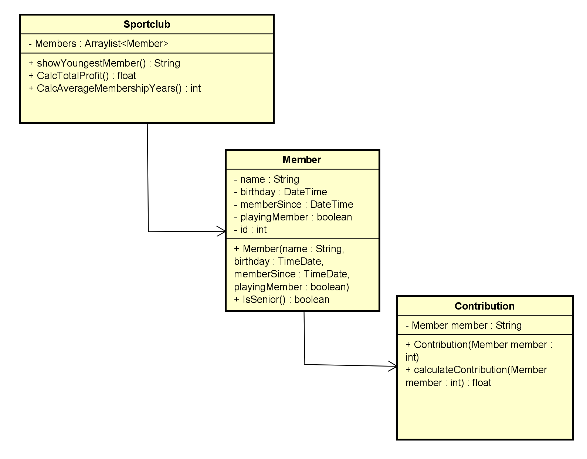

# Startdocument for Contribution application

Startdocument of **Monique Sabong**. Student number **5000742**.

## Problem Description

When determining the annual contribution for a sports association, we have
the following rules: Senior members pay €150, junior members €75. You're a
senior member if you're 18 years or older. Playing members have to pay
€45 bond contribution extra. For members who have been a member for more than 7 years will get a 5% discount.

You need to develop a program for each member by name,
date of birth and date of entry into membership (format dd-mm-yyyy)
also if the member is a playing or non-playing member. For each member,
the contributions should be calculated and displayed. Furthermore, cumulatively, the total
membership fee should be displayed, the average number of years of membership and displaying the youngest member
gives.

### Input & Output

In this section the in- and output of the application will be described.

#### Input

In the table below all the input (that the user has to input in order to make the application work) are described.

|Case|Type|Conditions|
|----|----|----------|
|Name of Sportclub|`String`|not empty|
|Name Of Member|`String` |not empty|
|DOB of Member|`DateTime` |dd-mm-yyyy|
|Member since date|`dd:mm:yyyy`|not empty|
|PlayingMember|`boolean`|not empty|
|Member ID|`int`|not empty|

#### Output

|Case|Type|
|----|----|
|The cumulative total contribution price|`float`|
|Youngest member at the sportclub|`String`|
|The average number of membership years|`int`|
|Contribution price for a member|`float`|

#### Calculations

| Case              | Calculation                        |
| ----------------- | ---------------------------------- |
| Total contribution of 1 member | The sum of all the contribution prices of 1 member |
| Total contribution of all the members in the sportclub|The sum of all the contribution prices of all the members|
| The 5% discount if a member has a membership longer than 7 years|0.05 x the total contribution price from a member|

#### Remarks

* Input will be validated.
* Only the Main class will contain `System.out.println`
* Unit Tests will be provided.

## Lay-out of GUI

## Class Diagram

## Testplan

In this section the testcases will be described to test the application.

### Test Data

In the following table you'll find all the data that is needed for testing.

#### Member

| ID            | Input                             | Code                              |
| ------------- | --------------------------------- | --------------------------------- |
| `Monique1` | name: Monique1  date of birth: 22-09-2006  member since: 05-11-2020   playing member: TRUE  | `new Member("Monique1", "22-09-2006", "05-11-2020", TRUE)` |
| `Monique2` | name: Monique2  date of birth: 22-10-2006  member since: 05-11-2020   playing member: TRUE  | `new Member("Monique2", "22-10-2006", "05-11-2020", FALSE)` |
| `Monique3` | name: Monique3  date of birth: 22-10-2006  member since: 05-11-2014   playing member: TRUE  | `new Member("Monique3", "22-10-2006", "05-11-2014", FALSE)` |
| `Henry1` | name: Henry1  date of birth: 23-05-2002  member since: 11-06-2020   playing member: TRUE  | `new Member("Henry1", "23-05-2002", "11-06-2020", TRUE)` |
| `Henry2` | name: Henry2  date of birth: 23-05-2002  member since: 11-06-2020   playing member: TRUE  | `new Member("Henry2", "23-05-2002", "11-06-2020", FALSE)` |
| `Henry3` | name: Henry3  date of birth: 23-05-2002  member since: 11-06-2014   playing member: TRUE  | `new Member("Henry3", "23-05-2002", "11-06-2014", FALSE)` |

#### Sportclub

| ID        | Input                                                        | Code                                               |
| --------- | ------------------------------------------------------------ | -------------------------------------------------- |
| `Ice skating club`| name: Ice skating club  | `new Sportclub("Ice skating club")`|

### Test Cases

In this section the testcases will be described. Every test case should be executed with the test data as starting point.

#### #1 Checking if the member is a senior or not

Testing the method to check if a member is 18 years or older.

|Step|Input|Action|Expected output|
|----|-----|------|---------------|
|1| `Monique1` | `isSenior()` |FALSE|
|2| `Henry1` | `isSenior()`| TRUE| 

#### #2 Getting the contribution price for one member

Testing the method to calculate the total contribution price of a member.

|Step|Input|Action|Expected output|
|----|-----|------|---------------|
|1|`Monique1`|`calculateContribution(Monique1)`|120|
|2|`Monique2`|`calculateContribution(Monique2)`)|75|
|3|`Monique3`|`calculateContribution(Monique3)` |114|
|4|`Henry1`|`calculateContribution(Henry1)`|195|
|5|`Henry2`|`calculateContribution(Henry2)`|150|
|6|`Henry3`|`calculateContribution(Henry3)`|142,50|

#### #3 Getting the total contribution price of a sportclub

Testing the method to calculate the total contribution price of all the members in a club.

|Step|Input|Action|Expected output|
|----|-----|------|---------------|
|1|`Ice skating club`|`CalcTotalContribution(Ice skating club)`|753,75|

#### #4 Getting the youngest member of the sportclub

Testing the method to show the youngest member of the sportclub

|Step|Input|Action|Expected output|
|----|-----|------|---------------|
|1|`Members`| `showYoungestMember(Arraylist<Member>)`|Monique1|

#### #5 Getting the average amount of membership years

Testing the method of calculating the average amount of membership years

|Step|Input|Action|Expected output|
|----|-----|------|---------------|
|1|`Members`|`calAverageMembershipYears(ArrayList<Member>)`|6 years|

